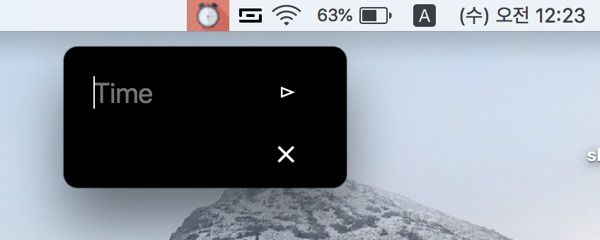
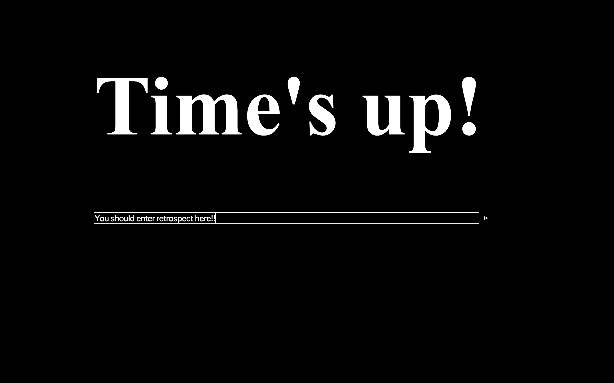
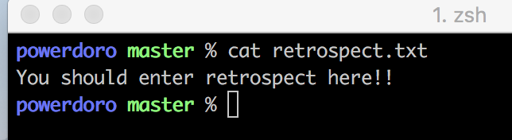

# Powerdoro
Pomodoro + small timer

Type in time you want, and after time has elapsed, this will be GRAB YOUR ATTENTION as 'small timer' does. But here is different!
You MUST TYPE IN `RETROSPECT` or some record what did you do in this time. Then block window will be disapear.
You can find your records in `retrospect.txt`

I'll make this timer can repeat automatically like pomodoro timer.
I have many things to do. You can check roadmap below this README (It is written in Korean) and feel free to add issues.

Enjoy your flow!


# Installation and Usage
## Installation
```
$ git clone https://github.com/ErickRyu/Powerdoro.git
$ cd Powerdoro
$ npm install
$ npm start
```
## Usage
### Click tray, enter time and start


### Time's over


### You should enter retrospect and then it will be closed


### You can read your retrospect in retrospect.txt


# Roadmap
[Trello board](https://trello.com/b/zDA1vG6u)
